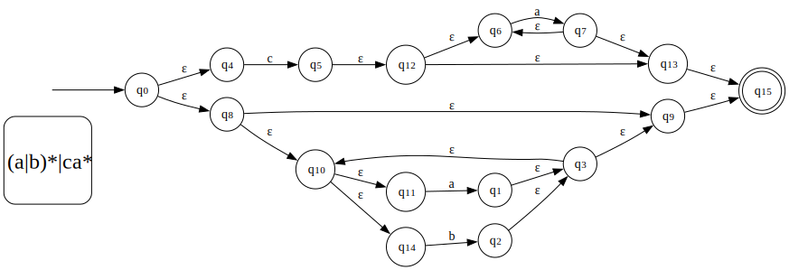
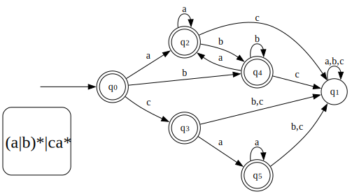
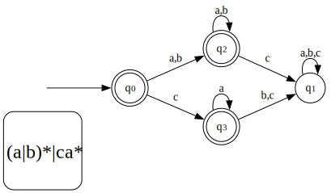

# NFA or DFA constructor

The NFA class in nfa.py consists of the following methods
- Constructor - Constructs an NFA using a Regex string
- `matches(r)` - Checks if a string matches the NFA / DFA
- `epsilon_closure(q)` - Returns the set of states reachable from those in `q` without consuming any characters
- `move(q, c)` - Returns the set of states reachable from those in `q` using only character 'c'
- `nfa_to_dfa()` - Converts itself to a DFA
- `is_dfa()` - Checks if it is a DFA
- `statecount()` - Returns number of states in this NFA / DFA
- `minimize_dfa()` - Return a minimized DFA
- `generate_svg(s)` - creates a `.svg` file to visualize the NFA / DFA having filename s

## Usage

To use the NFA first a Regex class needs to be formed using a regular expression string.
The Regex class has support for following regex
- `*` - Star Regex (`"a*b"`)
- `|` - Disjoint Regex (`"a|b"`)
- Sequential Regex (`"ab"`)

### Example

```python
from nfa import *

r = regex("(a|b)*|(ca*)")

nfa = NFA(r)
nfa.generate_svg("nfa")

dfa = nfa.nfa_to_dfa()
dfa.generate_svg("dfa")

min_dfa = dfa.minimize_dfa()
min_dfa.generate_svg("min_dfa")
```
### Result
- NFA



- DFA



- Minimized DFA



## Dependency
- `graphviz` - For generating SVG for visualization